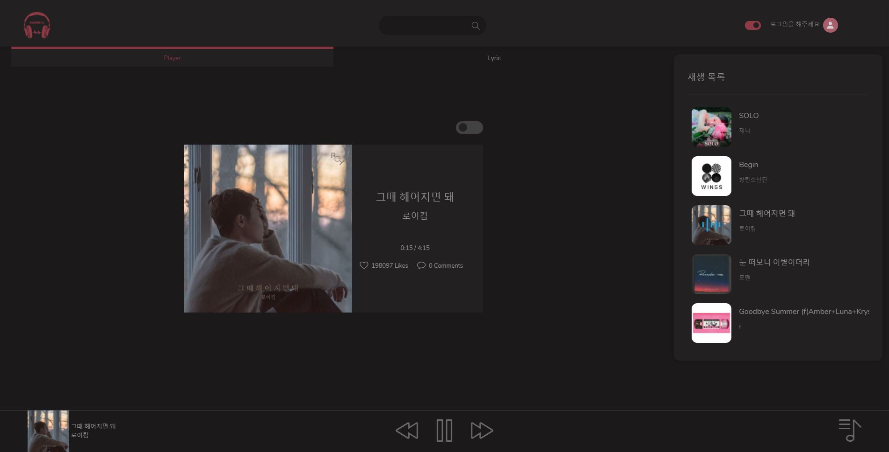
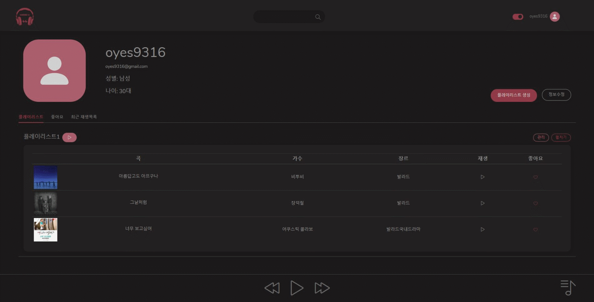
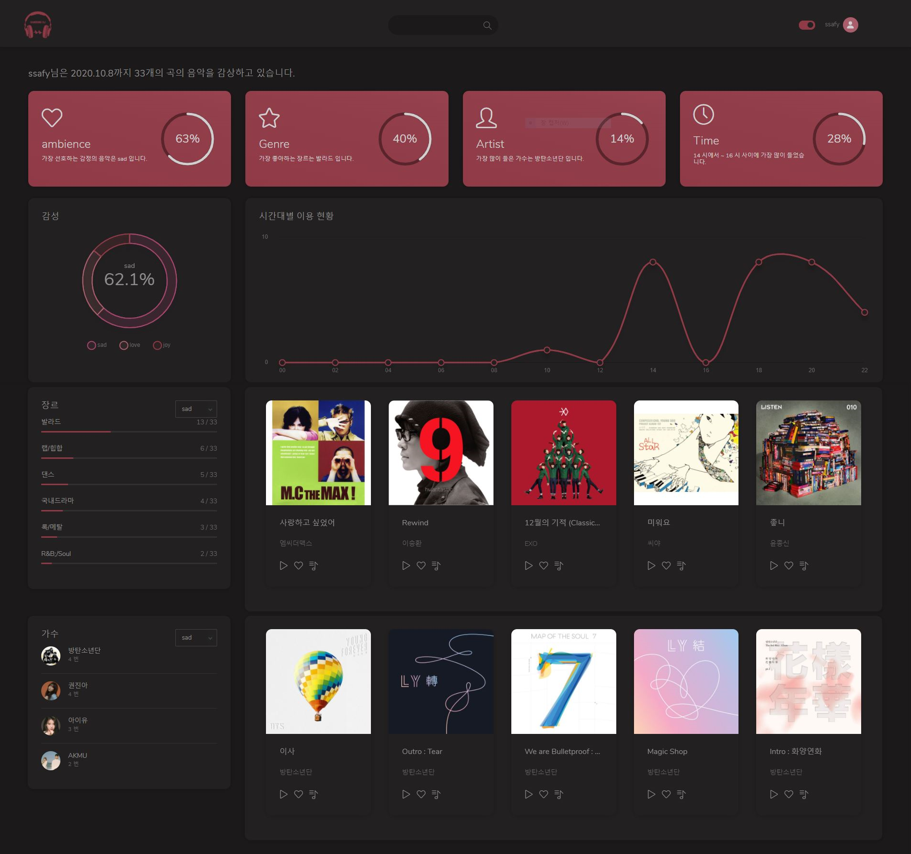

# 감성 DJ
 
[http://j3a505.p.ssafy.io/](http://i3a402.p.ssafy.io/)
   
## :mag_right: 서비스 소개

### 텍스트마이닝을 통한 가사의 감정분석, 감정 기반 음악 추천 서비스

   
### 이용자의 시간, 장소를 파악하여 협업필터링 기반의 날씨/시간대별 음악 추천 서비스

   
### 누구나 이용할 수 있는 뮤직 플레이어 기능

   
### 원하는 음악을 찾아서 자신만의 플레이리스트를 만들고 관리할 수 있는 기능 

   
### 사용자의 음악감상 패턴을 분석하여 음악을 추천해주는 맞춤형 서비스 뮤직DNA

   
## :family: 팀 소개
팀장 정윤환 : 데이터셋 스크래핑 및 감정 학습, 음악 추천/검색 컨트롤러 설계 및 구성, 서비스 배포 및 인프라 담당
팀원 김유창 : 메인페이지 화면구성, 재생 컨트롤바 및 재생목록 화면구성, 뮤직DNA 화면 구성
팀원 오정엽 : 검색기능 화면 구성, 음악, 앨범, 아티스트 세부페이지 화면구성
팀원 오지수 : OAuth 2.0 소셜 인증 및 유저 페이지 구성, 회원 기능, 플레이리스트 컨트롤러 설계 및 구성
   
## :calendar: 개발 일정

   
## :wrench: 기술 스택

   
## :wrench: 아키텍쳐

